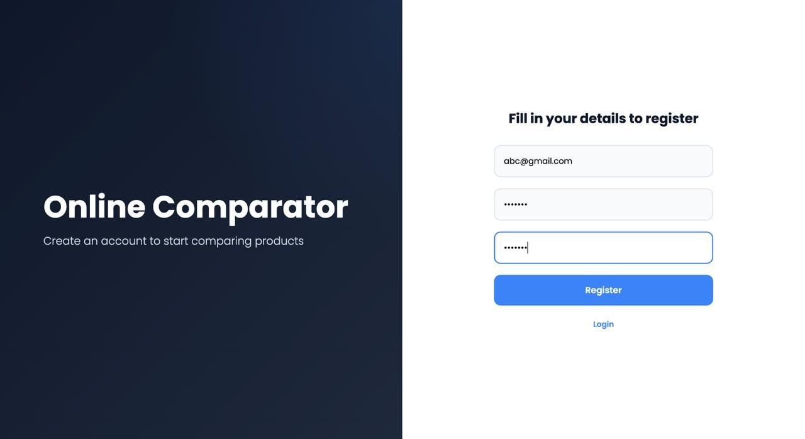
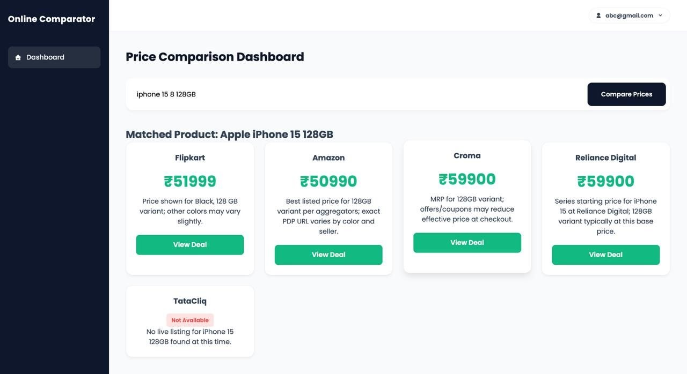
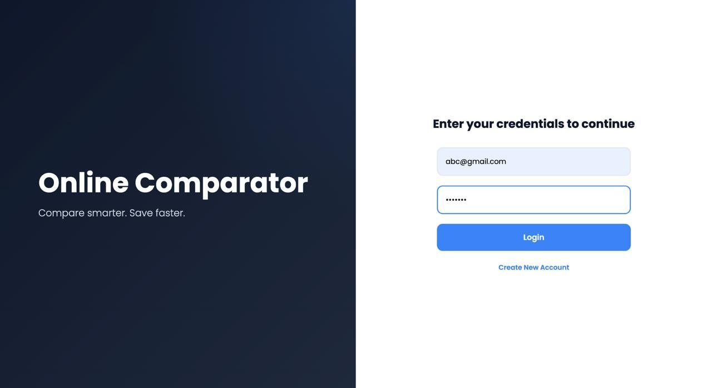
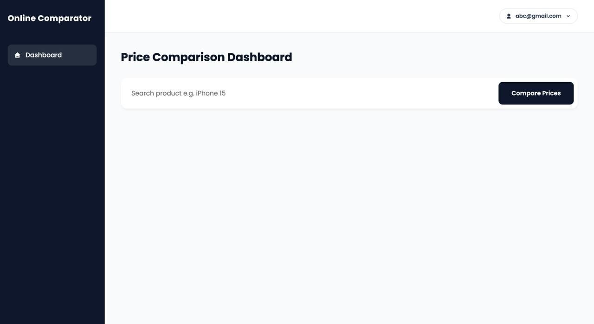

<h1 align="center">🛒 Online Price Comparator</h1>

<p align="center">
  <b>Compare product prices across India's top e-commerce stores in real-time</b>
  <br>
  <i>Compare smarter. Save faster.</i>
</p>

<p align="center">
  
  
  
  
  
  
</p>

---

## ✨ Features

| Feature | Description |
|---|---|
| **🔐 User Authentication** | Register & login with bcrypt-hashed passwords, persistent Flask sessions (7 days) |
| **🔍 Live Price Search** | Fetch real-time prices from Perplexity AI's `sonar-pro` model |
| **🏪 5 Indian Stores** | Amazon.in, Flipkart, Croma, Reliance Digital, TataCliq |
| **📊 Visual Dashboard** | Card-based UI with availability badges, INR prices, and "View Deal" links |
| **👤 Profile Management** | Inline editing of phone number linked to your account |
| **📱 Responsive Design** | Modern UI with Poppins font, Remixicon icons, mobile-friendly layout |
| **🔄 Dual UI** | Flask web app (primary) + Streamlit backup (alternative) |

---

## 🖥 Screenshots

<p align="center">
  
  
  <br>
  <em>Login and Registration pages with split-screen layout</em>
</p>

<p align="center">
  
  
  <br>
  <em>Price Comparison Dashboard and Profile editing page</em>
</p>

---

## 🏗 Architecture

```
┌──────────────────────────────────────────────────────────┐
│                      User's Browser                       │
└──────────────────┬───────────────────────────────────────┘
                   │
                   ▼
┌──────────────────────────────────────────────────────────┐
│                    Flask App (flask_app.py)               │
│                                                          │
│  ┌──────────┐  ┌──────────┐  ┌──────────┐  ┌─────────┐  │
│  │  Login   │  │ Register │  │Dashboard │  │ Profile │  │
│  │ /login   │  │/register │  │/dashboard│  │ /profile│  │
│  └────┬─────┘  └────┬─────┘  └────┬─────┘  └────┬────┘  │
│       └──────────────┼─────────────┼──────────────┘       │
│                      │             │                      │
│               ┌──────▼─────────────▼──────┐               │
│               │  Flask Sessions (auth)    │               │
│               └───────────────────────────┘               │
└──────────────────┬────────────────────────────────────────┘
                   │
                   ▼
┌──────────────────────────────────────────────────────────┐
│            streamlit_version_backup.py (Core Logic)       │
│                                                          │
│  ┌─────────────────┐       ┌──────────────────────────┐  │
│  │  Auth Helpers    │       │  Perplexity Integration  │  │
│  │  (bcrypt/MongoDB)│       │  fetch_prices_from_      │  │
│  │                 │       │  perplexity(query)        │  │
│  └────────┬────────┘       └───────────┬──────────────┘  │
│           │                            │                 │
│           ▼                            ▼                 │
│  ┌──────────────────────────────────────────────────┐    │
│  │              Perplexity AI API                    │    │
│  │         (sonar-pro model, web search)             │    │
│  └───────────────────────┬──────────────────────────┘    │
│                          │                               │
│                          ▼                               │
│  ┌──────────────────────────────────────────────────┐    │
│  │                MongoDB Atlas                       │    │
│  │  ┌──────────────────────────────────────────────┐ │    │
│  │  │              users Collection                  │ │    │
│  │  │  { email, password(hashed), phone, createdAt } │ │    │
│  │  └──────────────────────────────────────────────┘ │    │
│  └──────────────────────────────────────────────────┘    │
└──────────────────────────────────────────────────────────┘
```

### Data Flow: Price Search

```
User searches "iPhone 15"
         │
         ▼
  Flask POST /dashboard
         │
         ▼
  fetch_prices_from_perplexity("iPhone 15")
         │
         ▼
  Perplexity API → sonar-pro model
  [searches Amazon, Flipkart, Croma, etc.]
         │
         ▼
  Returns structured JSON:
  { product_title, stores: [{store, price, link, ...}] }
         │
         ▼
  Parsed & mapped to TARGET_STORES
         │
         ▼
  Rendered as store cards in dashboard.html
```

---

## 🛠 Tech Stack

| Layer | Technology |
|---|---|
| **Backend** | Python 3.14 · Flask · Jinja2 Templating |
| **Database** | MongoDB Atlas (cloud, via PyMongo) |
| **AI / Search** | Perplexity AI API (`sonar-pro`) |
| **Auth** | bcrypt · Flask Sessions (7-day lifetime) |
| **Frontend** | HTML5 · CSS3 (custom properties) · Poppins · Remixicon |
| **Alt. UI** | Streamlit |
| **HTTP** | `requests` library |

---

## 📁 Project Structure

```
price_comparator/
├── flask_app.py                   # 🚀 Main Flask application (routes, server)
├── streamlit_version_backup.py    # 🔄 Streamlit backup (core business logic)
├── requirements.txt               # 📦 Python dependencies for pip install
├── .env.example                   # 🔑 Template for environment variables
├── .env                           # 🔒 Environment variables (git-ignored)
├── .gitignore                     # Python, venv, .env, OS files
│
├── assets/
│   ├── login-page.jpeg            # Login page screenshot
│   ├── register-page.jpeg         # Register page screenshot
│   ├── dashboard-page.jpeg        # Dashboard page screenshot
│   └── profile-page.jpeg          # Profile page screenshot
│
├── static/
│   └── style.css                  # 🎨 Complete CSS design system (354 lines)
│
└── templates/
    ├── auth_base.html             # Base template for auth pages
    ├── base.html                  # Base template for dashboard (sidebar + navbar)
    ├── layout.html                # Simpler alternative layout
    ├── login.html                 # Split-screen login page
    ├── register.html              # Split-screen registration page
    ├── dashboard.html             # Price comparison dashboard
    └── profile.html               # Profile editing page
```

---

## 🚀 Quick Start

### Prerequisites

- Python 3.14+
- MongoDB Atlas account (or local MongoDB)
- Perplexity API key ([get one here](https://www.perplexity.ai/settings/api))

### 1. Clone & Setup

```bash
git clone https://github.com/abhinav7830tech/Online-Price-Comparator.git
cd price_comparator
python3 -m venv venv
source venv/bin/activate   # Windows: venv\Scripts\activate
```

### 2. Install Dependencies

```bash
pip install -r requirements.txt
```

### 3. Configure Environment

Copy `.env.example` to `.env` and fill in your credentials:

```bash
cp .env.example .env
```

```env
MONGO_URI=mongodb+srv://<username>:<password>@cluster.mongodb.net/?retryWrites=true&w=majority
MONGO_DB_NAME=price_comparator
PPLX_KEY=pplx-xxxxxxxxxxxxxxxxxxxxxxxxxxxxxxxxxxxxxxxxxxxxxxxxxxxxxxxx
```

### 4. Run the App

```bash
# Flask version (primary) — http://localhost:5000
python3 flask_app.py

# Streamlit version (alternative) — http://localhost:8501
streamlit run streamlit_version_backup.py
```

---

## 🖥 Pages

| Page | Route | Description |
|---|---|---|
| **Login** | `/login` | Split-screen login with email & password |
| **Register** | `/register` | Account creation with password confirmation |
| **Dashboard** | `/dashboard` | Product search + store price comparison cards |
| **Profile** | `/profile` | View/edit phone number for your account |

---

## 🔑 API Reference

### Perplexity Integration

The app uses Perplexity AI's `sonar-pro` model with a **system prompt** designed to return structured JSON:

```python
SYSTEM_PROMPT = """
You are an expert Procurement Agent...
Return ONLY valid JSON with format:
{
  "product_title": "Product Name",
  "stores": [
    {"store": "Amazon", "available": true, "price": 10000, "link": "...", "notes": ""},
    ...
  ]
}
"""
```

**Endpoint:** `POST https://api.perplexity.ai/chat/completions`  
**Auth:** Bearer token via `PPLX_KEY` environment variable  
**Timeout:** 60 seconds  
**Temperature:** 0.1 (deterministic outputs)

---

## 🗄 Database Schema

**Collection:** `users` (MongoDB)

```json
{
  "email": "user@example.com",
  "password": "$2b$12$...",
  "phone": "+91-9876543210",
  "created_at": "2026-06-03T10:30:00Z"
}
```

---

## 🤝 Contributing

1. Fork the repository
2. Create a feature branch (`git checkout -b feature/amazing`)
3. Commit your changes (`git commit -m 'Add amazing feature'`)
4. Push to the branch (`git push origin feature/amazing`)
5. Open a Pull Request

---

## 📝 License

Distributed under the MIT License. See `LICENSE` for more information.

---

<p align="center">
  <b>Compare smarter. Save faster.</b>
  <br>
  <a href="https://github.com/abhinav7830tech/Online-Price-Comparator">GitHub Repository</a>
</p>
